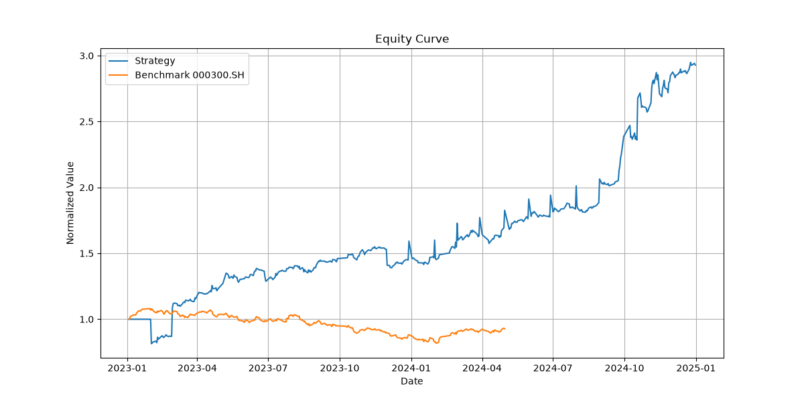

# AifaQuant - A股 AI 量化研究框架

[](https://github.com/ivyzhi0807/aifa-quant/actions)


[](https://github.com/ivyzhi0807/aifa-quant/releases)

个人本地运行的 A股 AI 量化研究与回测系统，以同花顺 iFind MCP 为主要数据源，支持从数据获取、因子构建、模型训练、策略回测到模拟交易的完整闭环。

> **English**: AifaQuant is a local-first A-share quantitative research and backtesting framework in Python. It uses iFind MCP as the primary data source, DuckDB for storage, LightGBM for stock selection, and a custom event-driven backtest engine with CSI 300 benchmark comparison.

## 快速开始

1. 复制环境变量模板并填入你的 MCP token（已完成 `.env`）：
   ```bash
   cp .env.example .env
   # 编辑 .env 填入真实 token
   ```

2. 安装依赖：
   ```bash
   pip install -r requirements.txt
   ```

3. 测试数据连接：
   ```bash
   python -m aifa_quant.cli.main test-connection
   ```

4. 更新本地数据：
   ```bash
   python -m aifa_quant.cli.main data-update --start 20230101 --end 20241231
   ```

5. 训练选股模型：
   ```bash
   python -m aifa_quant.cli.main train --start 20230101 --end 20231231 --horizon 5
   ```

6. 运行回测：
   ```bash
   python -m aifa_quant.cli.main backtest --start 20240101 --end 20241231 --top-k 3 --freq 5
   ```

## 项目结构

- `config/` - 配置管理（Pydantic Settings + `.env`）
- `data/adapters/` - iFind MCP 适配器（股票、宏观、新闻、指数）
- `data/storage/` - DuckDB 本地存储
- `data/pipeline/` - ETL 与增量更新
- `features/` - 因子工程（技术、财务、宏观、情绪）
- `models/` - AI 模型（LightGBM 等）
- `strategy/` - 策略定义
- `backtest/` - 回测引擎与绩效分析
- `execution/` - 模拟/实盘交易执行
- `cli/` - 命令行入口
- `notebooks/` - 研究与探索

## CLI 命令

```bash
# 查看帮助
python -m aifa_quant.cli.main --help

# 常用工作流
python -m aifa_quant.cli.main test-connection
python -m aifa_quant.cli.main data-update --start 20230101 --end 20241231
python -m aifa_quant.cli.main db-info
python -m aifa_quant.cli.main train --start 20230101 --end 20231231
python -m aifa_quant.cli.main backtest --start 20240101 --end 20241231 --top-k 3

# 滚动训练 + 沪深 300 基准对比
python -m aifa_quant.cli.main backtest --start 20240101 --end 20241231 --top-k 5 --freq 5 --rolling --benchmark 000300.SH
```

## 当前能力

- 股票池：上证 50 完整 50 只成分股（49 只已入库，1 只无数据）。
- 因子：技术面 + 基本面（PE / PB / ROE） + 宏观（CPI / PMI / M2）。
- 模型：LightGBM 二分类选股，支持滚动窗口 out-of-sample 预测。
- 回测：自定义 A股规则引擎，支持沪深 300 基准对比与超额收益计算。

## 最新回测结果（示例）

上证 50 成分股，2023–2024，技术面因子滚动训练，TopK=5，调仓频率 5 日：

| 指标 | 数值 |
|------|------|
| 总收益率 | 192.82% |
| 年化收益率 | 74.96% |
| 年化波动率 | 39.82% |
| 夏普比率 | 1.882 |
| 最大回撤 | -18.59% |
| 日胜率 | 52.38% |
| 沪深 300 基准收益 | -7.29% |
| 超额收益 | 200.11% |
| 超额夏普 | 1.531 |

### 净值曲线



> ⚠️ 以上为回测结果，存在过拟合、幸存者偏差和参数敏感性风险，不代表实盘表现。数据源见 [Release v0.2.0-data](https://github.com/ivyzhi0807/aifa-quant/releases/tag/v0.2.0-data)。

## 安全提示

`.env` 文件包含你的 iFind MCP token，**绝对不要提交到 Git**（已在 `.gitignore` 中排除）。
